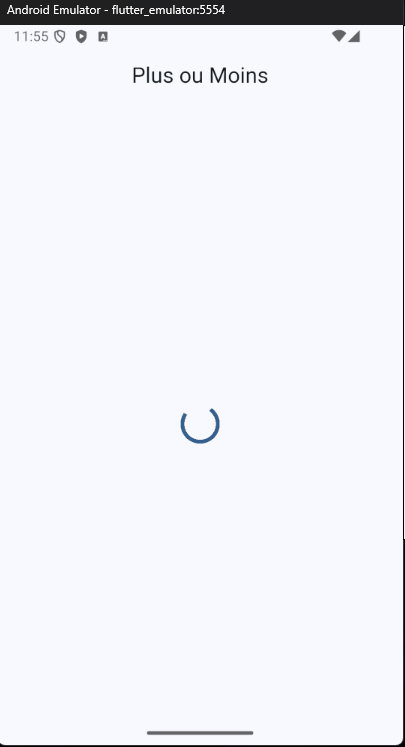
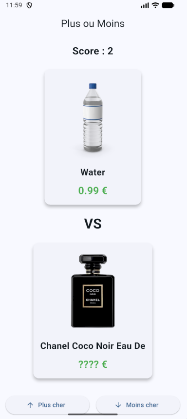
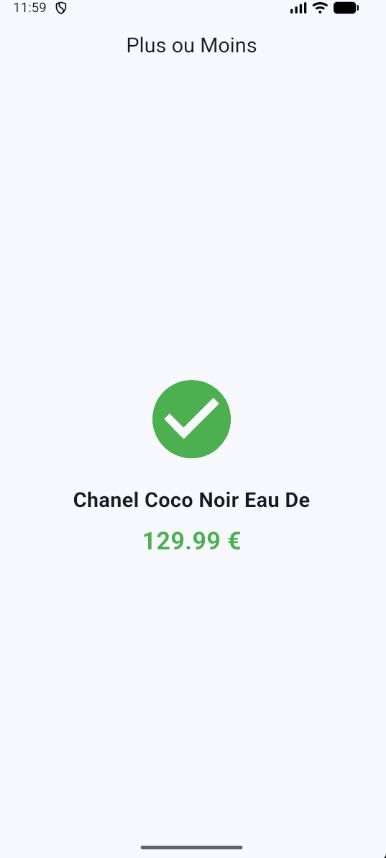
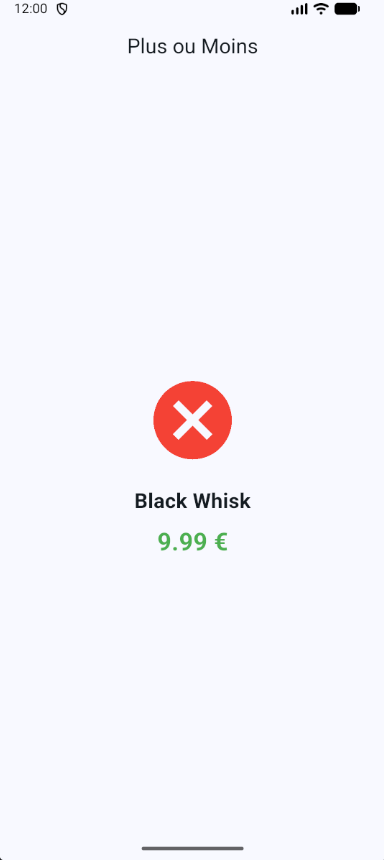
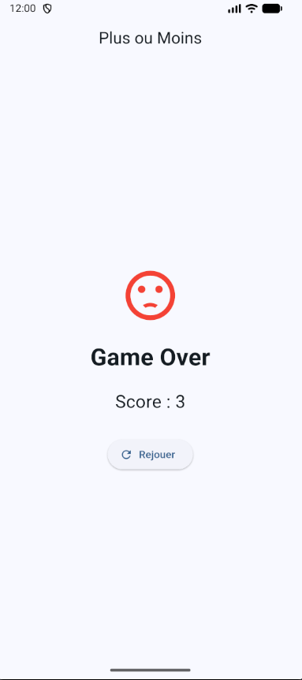
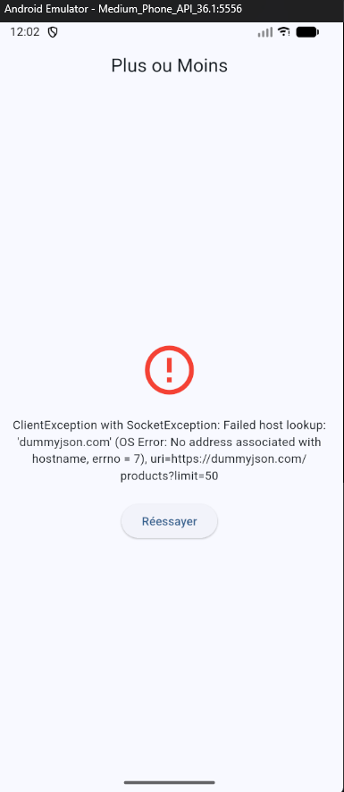

 # app-plus-moins-flutter

## description du jeu :

Le jeu est un Higher or Lower (Plus ou Moins) basé sur des produits récupérés via une API.

Le joueur doit comparer deux produits et deviner si le prochain produit est plus cher ou moins cher que le précédent.

Si la réponse est correcte → le score augmente et la partie continue
Si la réponse est fausse → Game Over
Le jeu continue jusqu’à épuisement des produits ou erreur du joueur

## packages utilisés et pourquoi :

flutter_riverpod
state_notifier
http
dart:math

## architecture :

/models → structure des données
/services → récupération API
/controllers → logique du jeu
/widgets → affichage UI

## instructions de lancement :

```flutter pub get```

```flutter run```

## captures d'écran :
 
### jeu en cours :









### game over



### état d'erreur




## Reponses aux questions :


## Quelle est la structure racine de la réponse ? (un objet ? une liste ? quels champs ?)

Un objet JSON

## Quels champs d'un produit vous sont réellement utiles pour ce jeu ? (Indice : vous n'avez pas besoin de tout modéliser.)

nom, prix, image

## Combien de produits récupérez-vous d'un coup, et comment évitez-vous de rappeler l'API à chaque tour ? (pensez au paramètre limit)

50 prod d'un coups
Cela permet d’éviter de rappeler l’API à chaque tour et d’améliorer les performances.

## Où placeriez-vous : l'appel réseau, la logique « le joueur a gagné/perdu », l'achage ? (3couches distinctes)

Appel réseau → Api
Logique du jeu (win/lose) → GameNotifier
Affichage UI → Widgets Flutter
